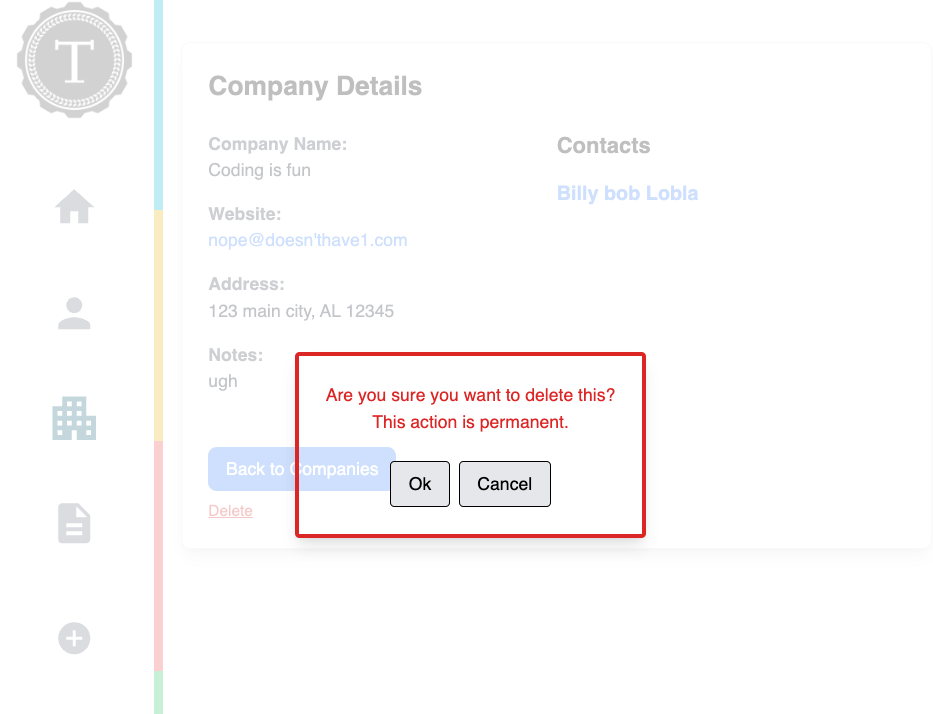

## Type of Change
- [ X ] feature ⛲
- [ X ] documentation update 📃
- [ X ] styling 🎨
- [ X ] testing 🧪

## Description
Added Delete Company functionality to the Company Show page.
Created a confirmation modal to verify before deletion.
Ensured associated contacts remain when a company is deleted.
Updated Cypress E2E tests to cover delete company flow.
Updated README to document the feature.

## Motivation and Context
This allows a user to delete a company from their list of associated companies while ensuring that any associated contacts are not removed and remain associated with the user.

## Related Tickets
closes #94 https://github.com/turingschool/tracker-crm/issues/94

## Screenshots (if appropriate):

## Added Test?
- [ X ] Yes 🫡
  - Cypress 
- [ X ] All previous tests still pass 🥳

## Checklist:
- [ X ] My code follows the code style of this project.
- [ X ] My change requires a change to the documentation.
- [ X ] I have updated the documentation accordingly.